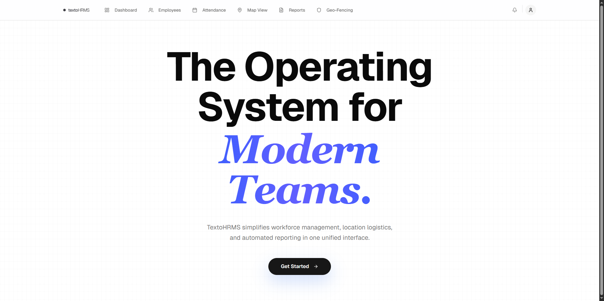

# TextoHRMS - Enterprise Workforce Management & Geospatial Intelligence

TextoHRMS is a comprehensive, production-grade solution for modern organizations to manage attendance, monitor field staff in real-time, and ensure geofence compliance. It consists of a high-performance **Next.js Admin Dashboard** and a robust **Expo Mobile Client**.


## 🏢 Project Overview

The system is split into two primary components:

1.  **[Texto Admin Dashboard](./texto-admin)**: A web-based control tower for HR and Operations to monitor workforce activities, manage employees, and visualize geospatial data.
2.  **[Texto Mobile Client](./texto-client)**: A cross-platform mobile application for employees to check-in/out, with persistent background location tracking and automated geofencing logic.

---

## 🚀 Key Features

### 🖥️ Admin Dashboard

- **Geospatial Control Tower**: Real-time visualization of all active field staff on a live map.
- **Route Tracking**: Interactive polylines showing historical movement paths for any selected date.
- **Geofencing Management**: Define virtual boundaries (circular zones) for automated attendance triggers.
- **Performance Analytics**: Automated daily reports, attendance rates, and tardiness tracking.
- **Role-Based Access**: Secure authentication with admin-only controls for workforce management.

### 📱 Mobile Client

- **Seamless Attendance**: One-tap check-in/out with proximity-based verification.
- **Persistent Tracking**: Robust background location synchronization that works even when the app is minimized.
- **Smart Sync**: Throttled API updates to balance real-time visibility with battery efficiency.
- **Offline Support**: Local persistence of attendance states using MMKV.
- **Geofence Alerts**: Immediate feedback when entering or exiting work zones.

---

## 🛠️ Technology Stack

| Component               | Key Technologies                                          |
| :---------------------- | :-------------------------------------------------------- |
| **Frontend (Admin)**    | Next.js 15, Tailwind CSS 4, shadcn/ui, Google Maps API    |
| **Backend (Admin API)** | Next.js API Routes (Node.js), Mongoose, MongoDB           |
| **Mobile Client**       | Expo, React Native, MMKV, Expo Location, Background Tasks |
| **Shared**              | TypeScript, JWT Authentication, date-fns                  |

---

## ⚙️ Quick Start

### 1. Prerequisites

- Node.js (v18+)
- MongoDB instance (Local or Atlas)
- Google Maps API Key

### 2. Setup Admin Dashboard

```bash
cd texto-admin
npm install
# Configure .env (see texto-admin/README.md)
npm run dev
```

### 3. Setup Mobile Client

```bash
cd texto-client
npm install
# Configure API URL in services/api.ts
npx expo start
```

---

## 📂 Repository Structure

```text
.
├── texto-admin/          # Next.js Dashboard & API Backend
│   ├── src/app/          # Routes & API Endpoints
│   ├── src/models/       # Database Schemas
│   └── src/components/   # UI System
└── texto-client/         # Expo React Native App
    ├── app/              # Expo Router Pages
    ├── context/          # State Management
    └── services/         # API Integration
```

---

## 📄 License

This project is licensed under the MIT License.

## 📸 Screenshots


